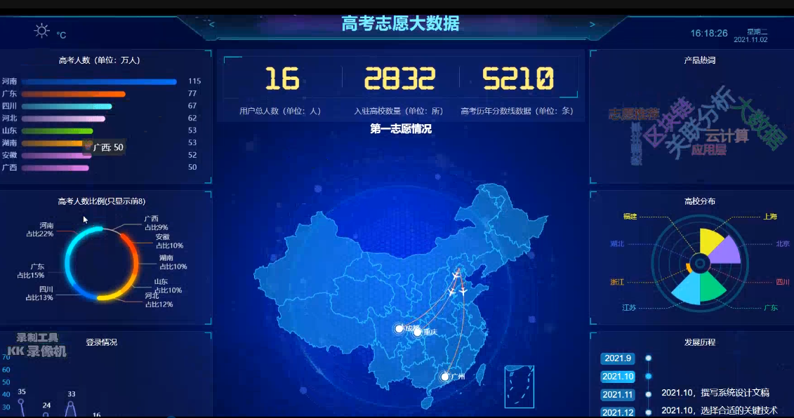
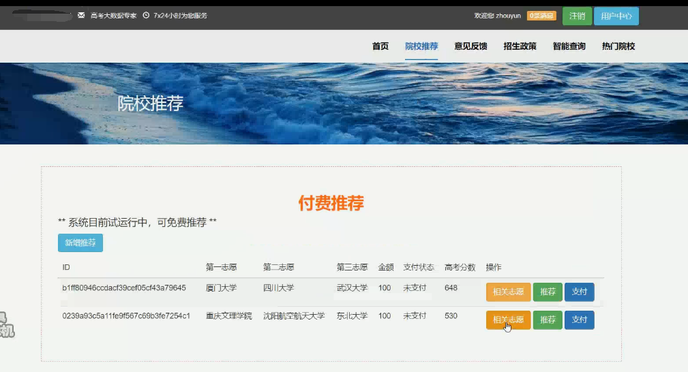
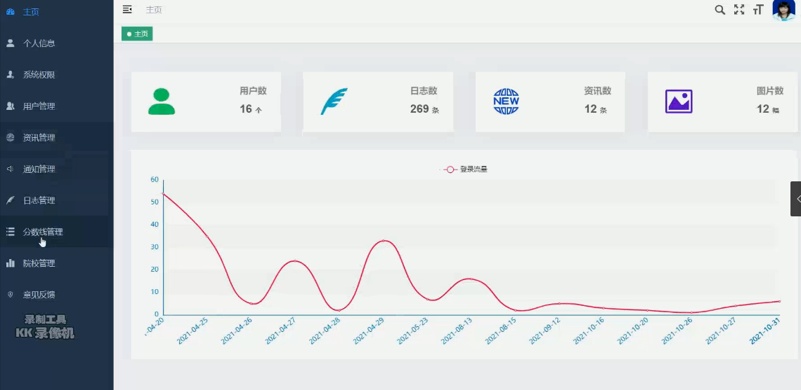
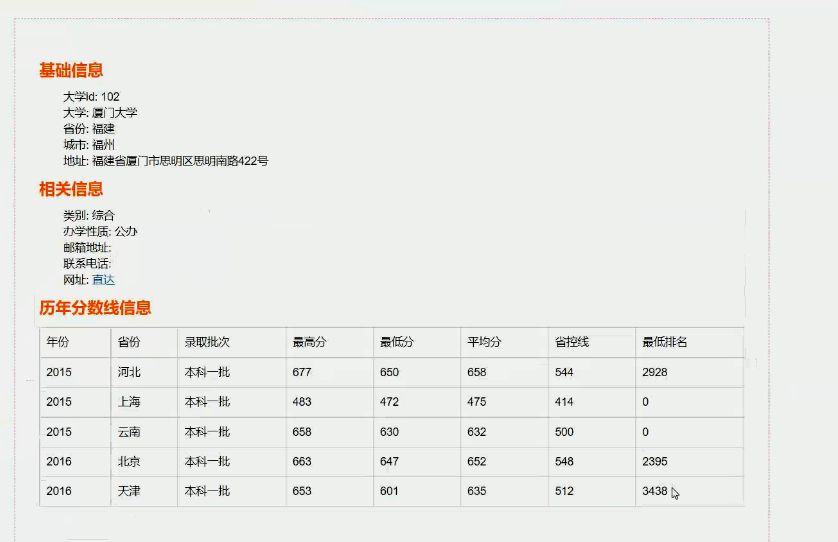

# 计算机毕业设计之SpringBoot+Vue.js高考志愿填写分析推荐系统 高考志愿推荐系统 高考大数据分析 大数据毕业设计(大屏、推荐算法、支付技术)

## 要求
源码一套有偿(论文 开题报告  文献综述  源码+sql脚本)
加好友前帮忙start一下，并备注github有偿获取源码
我的QQ号是2877135669或者2827724252
加qq好友说明（被部分 网友整得心力交瘁）：
    1.加好友务必按照格式备注
    2.避免浪费各自的时间！
    3.当“客服”不容易，repo 主是体面人，不爆粗，性格好，文明人。

https://www.bilibili.com/video/BV1WL41137GW?spm_id_from=333.999.0.0

# 【技术架构】

高考志愿填写分析推荐系统主要是基于Java语言的技术开发，同时使用SpringBoot框架，利用其自动装配的优点为我们简化许多配置代码；

前端开发主要使用Vue.js来进行页面的展示与布局；

使用阿里云OSS、本地mysql来进行数据的存储，通过整合MyBatis来进行对后台系统数据的管理，以及前端与数据库中数据的查取；利用Echarts进行数据的可视化分析。

# 【功能模块】

1.用户模块：

1.1用户登录后可以进行个人信息的查看以及修改。例如高考分数，考生省份...

1.2可以进行一对一的关于志愿的收费咨询。

1.3对志愿的模拟填写，通过填写的分数进行推荐。

2.管理员模块：

2.1对用户的信息进行管理。

2.2对首页院校广告位的院校信息进行上架与下架。

2.3对用户的反馈建议进行处理。

2.4对数据库信息的管理。

3.推荐模块：

3.1通过用户输入的分数可以进行两个层次的推荐，即能够冲一冲的、较为稳妥的。

3.2推荐在此分数段的考生，都有过那些志愿的填报

3.3管理员可以根据用户的分数进行相关推荐的管理以及推荐数量的管理。

4.院校查询模块：

4.1用户能够对院校的基本信息进行查询，包括官网、院校代码、院校地址、院校所属、专业详情的信息显示。

4.2能够对各个省份的招生政策进行查询。

4.3管理员能够对院校的相关信息进行更新或删除。

5.院校信息的展示模块（广告位）：

5.1管理员将部分院校的信息或图片展现在首页。

5.2用户能够通过首页，对热门院校进行直观的查看了解。

6.数据分析模块：

6.1通过各个省份的高考人数进行可视化的分析。

6.2对全国高校的数量进行可视化分析对比。

7.建议反馈模块：

7.1用户可以将本系统的不足或者错误进行提出问题建议。

7.2管理员对用户的建议与反馈进行处理并作出回应以及奖励。

# 【创新点】

1.拦截器：在未登录的前提下用户不可直接访问网页内部，并提示需登录，点击回到登录页面。

2.Echarts可视化分析：在首页中进行对院校的数量以及考生的人数进行可视化，能够直观的看出其分布。

3.算法设计：通过考生的分数以及地区，进行设计算法，来进行对院校的推荐。

4.支付宝沙箱支付技术

# 【运行截图】

# 运行视频B站
https://www.bilibili.com/video/BV1WL41137GW?spm_id_from=333.999.0.0

